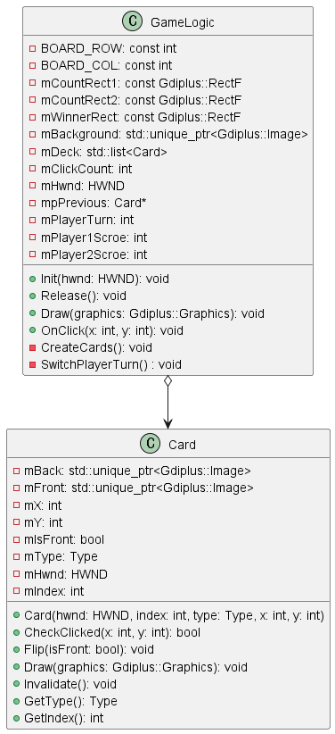

## 짝 맞추기 게임
뒤집힌 카드 더미에서 한 장씩 앞면을 확인할 수 있게 뒤집습니다. 짝이 맞으면 없어지고 모든 카드의 짝을 맞추게 되면 클리어하는 방식의 게임입니다. 2명이서 번갈아서 플레이하며 점수가 가장 높은 사람이 승리하게 됩니다. 해당 프로젝트는 GDI+를 이용해 구현하였습니다.

## 플레이 영상
https://github.com/river-zero/Memory_Game/assets/124229424/6bd31b46-5240-4569-9acc-15674fca659d

## 클래스 설계도

## 주요 기능
- 카드 더미 생성 및 배치
  - GameLogic::CreateCards 함수에서 카드 더미를 생성하고 섞어서 보드에 배치합니다.
  - mt19937 난수 생성기와 std::shuffle을 사용하여 카드를 무작위로 섞어 균등하게 분배합니다.
- 카드 뒤집기 및 짝 맞추기
  - Card::CheckClicked 함수로 클릭 시 카드의 앞면과 뒷면 상태를 전환합니다.
  - GameLogic::OnClick 함수에서 두 카드를 비교하여 짝이 맞으면 카드를 제거합니다. 
  - 비교 결과에 따라 화면을 업데이트합니다.
- 플레이어 점수 출력
  - GameLogic::Draw 함수에서는 각 플레이어의 점수를 화면에 표시합니다.
  - GDI+를 사용하여 텍스트를 그리고 플레이어의 점수가 변경될 때마다 화면을 업데이트합니다.
- 게임 결과 확인 및 승자 메시지 출력
  - GameLogic::Draw 함수와 GameLogic::OnClick 함수에서 모든 카드가 사라지면 플레이어 점수에 따라 승자 메시지를 출력합니다.

## 시행착오
> 이미지 크기가 큰 리소스를 사용하였는데 그래픽 요소 표현 시 너비와 높이를 줄여서 그려지도록 하였습니다. 그런데 게임 진행 속도가 현저히 느려지는 문제가 발생했습니다. 무엇이 문제인지 찾다가 이미지 크기를 줄이는 작업이 게임 성능에 영향을 미친다는 사실을 알게 되었고, 이미지 크기를 애초에 화면에 표시될 때의 크기만큼 줄인 상태에서 시작해 CPU 및 GPU 자원 낭비를 줄여 게임 성능을 개선하였습니다.

> 2인용 게임으로 재구성하는 과정에서 게임 결과를 확인하고 승자 메시지를 출력하는 작업에 애를 좀 먹었습니다. GameLogic::CheckGameResult 함수를 만들어서 GameLogic::OnClick 함수에서 호출하자니 Gdiplus::Graphics& graphics 매개변수가 문제가 되었습니다. GameLogic::Draw 함수에 바로 그리자니 게임 시작과 동시에 승자 메시지가 출력되어 어떻게 할까 고민이 되었습니다. 여러 작업을 거친 결과 if (mDeck.empty()) 문을 GameLogic::Draw 함수와 GameLogic::OnClick 함수에서 각각 조건을 걸고 코드를 구성하여 문제를 해결하였습니다. 

## 리소스 목록
|   이름    |    설명     |
| :-------: | :---------: |
| Board.jpg |    배경     |
| Back.png  |  카드 뒷면  |
|   7.png   |   7 카드    |
|  Ace.png  | 에이스 카드 |
| Joker.png |  조커 카드  |
| King.png  |   킹 카드   |

## 출처
- https://opengameart.org/content/vintage-playing-cards?page=1
- https://opengameart.org/content/weathered-wood-seamless-texture-with-normalmap
